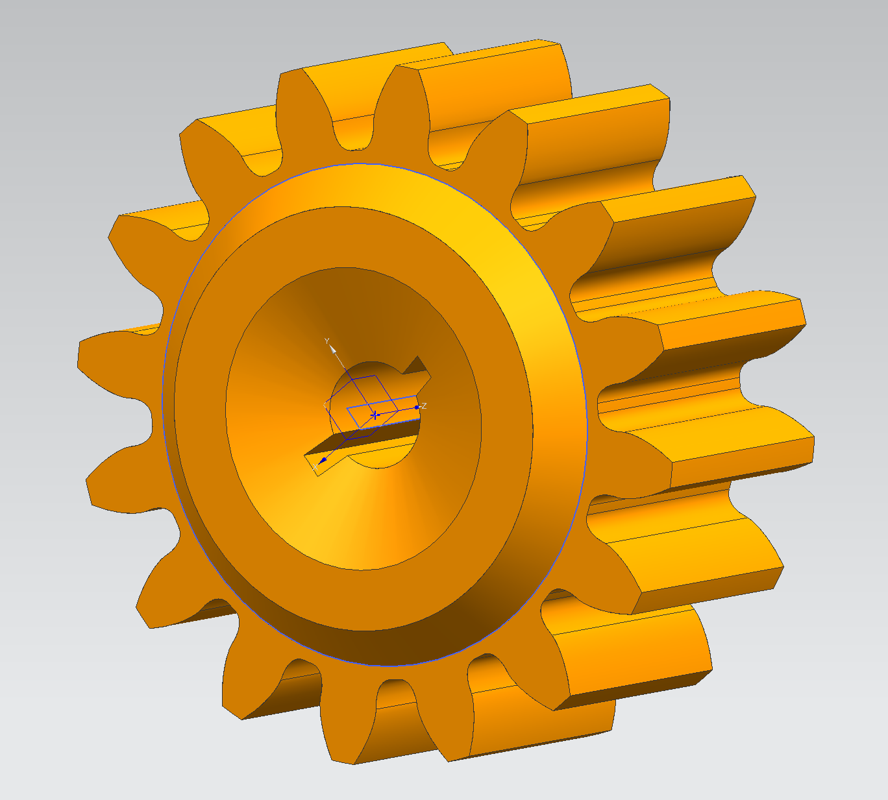

# 迷你小车改装遥控车教程

## 开源目录

- 齿轮: 后轮驱动齿轮，和前轮转向齿轮，0.2模数,有多种齿数
  + prt: UG格式
  + max：3Dmax格式
  + stl: 通用格式，可3D切片打印
  + obj：通用格式，可3D切片打印
- 车零件: 包含小车改装的一些车身组件，如雨刮器，驱动轮支架，转向轮支架等

- 小车积木组件: 包含积木式的车身组件，如底盘，连接件等，注:积木已有授权专利,仅用做学习交流不可商用，如需商用请联系作者授权
小车改装3D模型介绍

注意，模型均尺寸较小，建议使用光固化3D打印机进行打印，并且打印完成后用紫外灯充分照射固化,才可以勉强使用，刚性树脂材料较脆不适合用作齿轮,有条件的同学可以尝试更换更好材料或者购买合适的金属/尼龙齿轮

