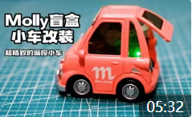
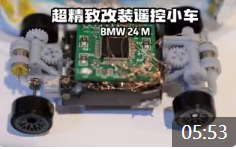

# 迷你小车改装遥控车教程

## 开源目录

- 3D model:3D模型，改装小车所需的零件（齿轮，雨刮器等，详见3Dmodel下的[README](/3D_model/README.md)）
- pcb：电路部分,电路图和pcb（主控板，电源板，驱动板，充电板等详见pcb下的[README](/pcb/README.md)）
- code：代码部分,主要是主控板所使用芯片（stm32c6t6）的控制程序（详见code下的[README](/code/README.md)）

声明：以上种种开源材料均个人设计，能力有限并非全部最优，有bug或者更好的解决方案欢迎交流贡献，每个贡献者都会留下你们的名字哦

## 一、看完本教程的你能获得什么？

1、我们都是喜爱小车的人，自己动手让小车动起来岂不是更帅

2、小车改装涉及机械设计，电路设计，基本元器件使用，c编程，如果你是初入机械电子相关专业的大学生或是对这方面知识感兴趣的业余人士，这都是一个练手的绝佳机会

## 二、准备工具

## 三、开始改装

### 3.1、实战视频

b站/抖音/小红书/等[@积木研究圆](https://space.bilibili.com/6888083?spm_id_from=333.1007.0.0)，持续更新，欢迎关注

[【精致手工】超精致的Molly盲盒遥控小车改装教学，赶紧上车！！！](https://www.bilibili.com/video/BV1tP4y1i7FT/?spm_id_from=333.999.0.0&vd_source=89cad0e1890ff49027d6a9f92e9147a6)

 

[【精致手工】从零开始的超精致遥控风火轮超跑小车改装，为你的小车注入灵魂，全是干货](https://www.bilibili.com/video/BV1Wg411a7io/?spm_id_from=333.999.0.0&vd_source=89cad0e1890ff49027d6a9f92e9147a6)

[【精致手工】从零开始的超精致遥控风火轮奥迪小车改装](https://www.bilibili.com/video/BV1X14y1e7VX/?spm_id_from=333.999.0.0&vd_source=89cad0e1890ff49027d6a9f92e9147a6)

 

[【精致手工】超精致遥控风火轮BMW小车改装过程](https://www.bilibili.com/video/BV1zN4y1F7QH/?spm_id_from=333.999.0.0&vd_source=89cad0e1890ff49027d6a9f92e9147a6)

### 3.2、芯片部分焊接
[【视频教程】芯片套件使用教程](https://www.bilibili.com/video/BV1zN4y1F7QH/?spm_id_from=333.999.0.0&vd_source=89cad0e1890ff49027d6a9f92e9147a6)

[【文档教程】芯片套件使用教程](https://www.wolai.com/w1vVhwLpsxBg7Ka8Gg3uaJ)

3.2.1、四合一模块拆解

3.2.2、焊接电源和开关

3.2.3、焊接红外接收头

3.2.4、焊接喇叭

3.2.5、焊接电机

3.2.6、焊接步进电机（雨刮器）

3.2.7、焊接灯光

3.2.8、通断驱动小板使用

3.2.9、正反驱动小板使用

3.2.10、充电小板使用

## 四、获取

通过开源的这些材料加上动手能力还行，即可完成自己的小车改装，如果嫌麻烦，作为量产区up主，电路部分（芯片组，包含各种电路板和一个红外接收头与遥控器），已半量产，后续更新详细使用教程，有需要的同学可各平台 **@积木研究圆**私信或留言。

量产芯片组套件长这样

 