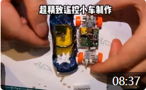

# 迷你小车改装遥控车教程

## 开源目录

### 1:64系列
- 3D model:3D模型，改装小车所需的零件（齿轮，雨刮器等，详见3Dmodel下的[README](/3D_model/README.md)）
- pcb：电路部分,电路图和pcb（主控小板，电源小板，驱动小板，充电小板等详见pcb下的[README](/pcb/1比64系列-STM32红外遥控方案/README.md)）
- code：代码部分,主要是主控板所使用芯片（stm32f103）的控制程序（详见code下的[README](/code/1比64系列-STM32/README.md)）
### 1:87系列
- 3D model:3D模型，改装小车所需的零件（齿轮，雨刮器等，详见3Dmodel下的[README](/3D_model/README.md)）
- pcb：电路部分,电路图和pcb（排插小板，充电小板等详见pcb下的[README](/pcb/1比87系列-STM8红外遥控方案/README.md)）
- code：代码部分,主要是主控板所使用芯片（stm8s003）的控制程序（详见code下的[README](/code/1比87系列-STM8/README.md)）
### 1:124坦克系列
- 3D model:3D模型，改装小车所需的零件（齿轮，驱动结构等，详见3Dmodel下的[README](/3D_model/README.md)）
- pcb：电路部分,电路图和pcb（主控小板，充电小板等详见pcb下的[README](/pcb/1比124坦克系列-STM8红外遥控方案/README.md)）
- code：代码部分,主要是主控板所使用芯片（stm8s003）的控制程序（详见code下的[README](/code/1比124坦克系列-STM8/README.md)）
### 真保姆级教程

- [【文档&视频教程】小车改装教程资料全览](https://www.wolai.com/ksv9qGV1nwmhjUrozgD7f1)

[//]: # (- [【视频教程】套件焊接教程]&#40;https://www.bilibili.com/video/BV16s4y1m7GQ/?spm_id_from=333.999.0.0&vd_source=89cad0e1890ff49027d6a9f92e9147a6&#41;)

声明：以上种种开源材料均个人设计，时间能力有限并非全部最优，有bug或者更好的解决方案欢迎交流贡献，每个贡献者都会留下你们的名字哦

## 一、看完本教程的你能获得什么？

1、我们都是喜爱小车的人，自己动手让小车动起来岂不是更帅

2、小车改装涉及机械设计，电路设计，基本元器件使用，c编程，如果你是初入机械电子相关专业的大学生或是对这方面知识感兴趣的业余人士，这都是一个练手的绝佳机会

## 二、主控小板简介
- 1:64主控小板

 

- 1:64遥控最小系统（主控小板+充电开关小板+电池+红外接收）

- 1:87主控小板

 

- 1:87遥控最小系统（主控小板+充电开关小板+电池+红外接收）

## 三、开始改装

### 3.1、实战视频

#### b站/抖音/小红书/等[@积木研究圆](https://space.bilibili.com/6888083?spm_id_from=333.1007.0.0)，持续更新，欢迎关注

[【自制】【开源】GTR小车改装教学，简单来个遥控灯光+喇叭](https://www.bilibili.com/video/BV1mk4y1G7Zi/?spm_id_from=333.999.0.0&vd_source=89cad0e1890ff49027d6a9f92e9147a6)

[【自制】【开源】遥控小车改装 1:87系列第一辆实验车](https://www.bilibili.com/video/BV1Hh4y1E79n/?spm_id_from=333.999.0.0&vd_source=89cad0e1890ff49027d6a9f92e9147a6)

[【自制】超精致遥控小车改装，红旗L5雨刮升级版！！！](https://www.bilibili.com/video/BV1os4y1B7c6/?spm_id_from=333.999.0.0&vd_source=89cad0e1890ff49027d6a9f92e9147a6)

[【自制】超精致蝙蝠侠战车魔改遥控小车！全是干货已开源！！！](https://www.bilibili.com/video/BV1eh41177br/?spm_id_from=333.999.0.0&vd_source=89cad0e1890ff49027d6a9f92e9147a6)

[【自制】超精致风火轮小车魔改遥控小车！全是干货已开源！！！](https://www.bilibili.com/video/BV1SX4y1R7Et/?vd_source=89cad0e1890ff49027d6a9f92e9147a6)

[【自制】【开源】小伙子，你这什么车啊？AE86 1:64遥控小车改装！！！](https://www.bilibili.com/video/BV1Nj411u79n/?vd_source=89cad0e1890ff49027d6a9f92e9147a6)

[【精致手工】超精致的Molly盲盒遥控小车改装教学，赶紧上车！！！](https://www.bilibili.com/video/BV1tP4y1i7FT/?spm_id_from=333.999.0.0&vd_source=89cad0e1890ff49027d6a9f92e9147a6)

 

[【精致手工】从零开始的超精致遥控风火轮超跑小车改装，为你的小车注入灵魂，全是干货](https://www.bilibili.com/video/BV1Wg411a7io/?spm_id_from=333.999.0.0&vd_source=89cad0e1890ff49027d6a9f92e9147a6)

[【精致手工】从零开始的超精致遥控风火轮奥迪小车改装](https://www.bilibili.com/video/BV1X14y1e7VX/?spm_id_from=333.999.0.0&vd_source=89cad0e1890ff49027d6a9f92e9147a6)

 

[【精致手工】超精致遥控风火轮BMW小车改装过程](https://www.bilibili.com/video/BV1zN4y1F7QH/?spm_id_from=333.999.0.0&vd_source=89cad0e1890ff49027d6a9f92e9147a6)

[//]: # (### 3.2、芯片部分焊接)

[//]: # ([【视频教程】芯片套件使用教程]&#40;https://www.bilibili.com/video/BV16s4y1m7GQ/?vd_source=89cad0e1890ff49027d6a9f92e9147a6&#41;)

[//]: # ()
[//]: # ([【文档教程】芯片套件使用教程]&#40;https://www.wolai.com/6ByrQANPkSRUSvC9mzMfy1&#41;)

[//]: # ()
[//]: # (3.2.1、四合一模块拆解)

[//]: # ()
[//]: # ()

[//]: # ()
[//]: # (3.2.2、焊接电源和开关)

[//]: # ()
[//]: # ()

[//]: # ()
[//]: # (3.2.3、焊接红外接收头)

[//]: # ()
[//]: # ()

[//]: # ()
[//]: # (3.2.4、焊接喇叭)

[//]: # ()
[//]: # ()

[//]: # ()
[//]: # (3.2.5、焊接电机)

[//]: # ()
[//]: # ()

[//]: # ()
[//]: # (3.2.6、焊接步进电机（雨刮器）)

[//]: # ()
[//]: # ()

[//]: # ()
[//]: # (3.2.7、焊接灯光)

[//]: # ()
[//]: # ()

[//]: # ()
[//]: # (3.2.8、通断驱动小板使用)

[//]: # ()
[//]: # ()

[//]: # ()
[//]: # (3.2.9、正反驱动小板使用)

[//]: # ()
[//]: # ()

[//]: # ()
[//]: # (3.2.10、充电小板使用)

[//]: # ()
[//]: # ()

[//]: # (## 四、获取)

[//]: # ()
[//]: # (- 懒得画电路敲代码可淘宝搜“积木研究圆的小车改装店”，有部分现成提供&#40;随缘上架哦！&#41;)

[//]: # (- 1:64芯片套件：[https://item.taobao.com/item.htm?ft=t&id=737362891443]&#40;https://item.taobao.com/item.htm?ft=t&id=737362891443&#41;)

[//]: # (- 1:87改装套件：[https://item.taobao.com/item.htm?ft=t&id=737272654141]&#40;https://item.taobao.com/item.htm?ft=t&id=737272654141&#41;)

[//]: # ()
[//]: # (- 量产芯片组套件长这样)

[//]: # ()
[//]: # ( )