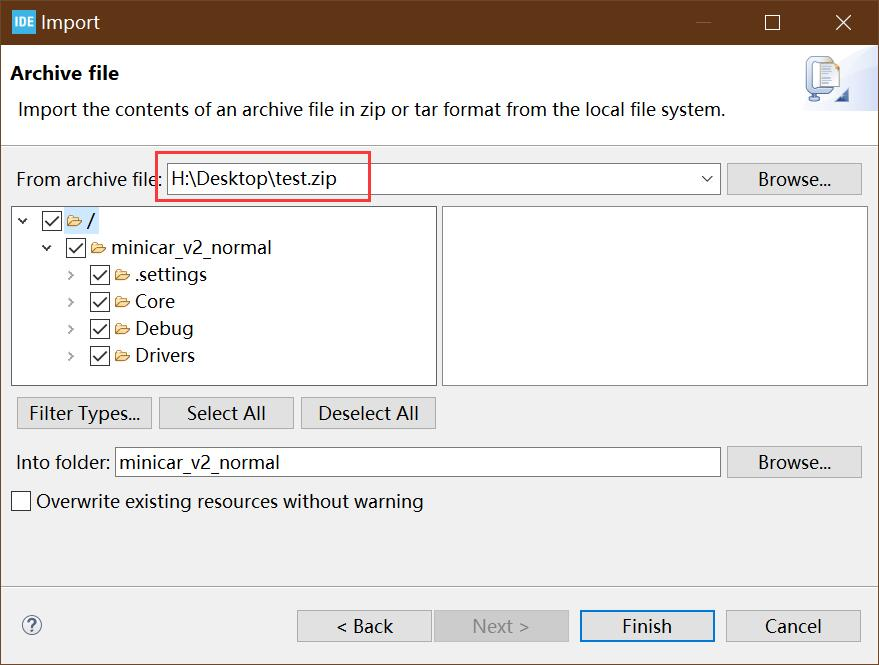

# 小车改装3D模型介绍

## 开源目录

- CubeIDE_WorkSpace_MiniCar: CubeIDE所有项目文件压缩包，可直接导入或解压后打开，具体见文末
- Inc: 头文件
- Src: 源代码
- Startup: 芯片stm32f103c6t6的Startup文件

主控芯片中的程序使用st官方CUBE IDE编写，使用CUBE IDE导入或者取需要部分到自己代码中都可

## 下载方式：

- 1、st link下载(SWD方式)，st link网上购买即可，代码导入CUBE IDE后，插上st link，st link另一端接到芯片相应接口

- 2、串口下载，使用USB转TTL模块，连接芯片串口uart1，电脑端将编译好的hex文件，通过串口助手下载

- 3、总出问题或嫌麻烦，该芯片组部分已量产，可直接咸鱼@积木研究圆购买，各模块已焊好，芯片已下好程序

## 注意
- 代码注释较少且不保证最优，但可正常运行，后续会优化

## 保姆级分享CubeIDE烧录程序方式（想自定义芯片套件代码的可以看这里）

- 1、CubeIDE_WorkSpace_MiniCar中的zip代码压缩包导入CUBE IDE，点击file->import

- 2、选择zip代码压缩包

- 3、st link程序下载

- 4、swd方式与小板接线

- 5、swd配置

- 6、代码下载：点击Run->Run as->stm32 c/c++ application
