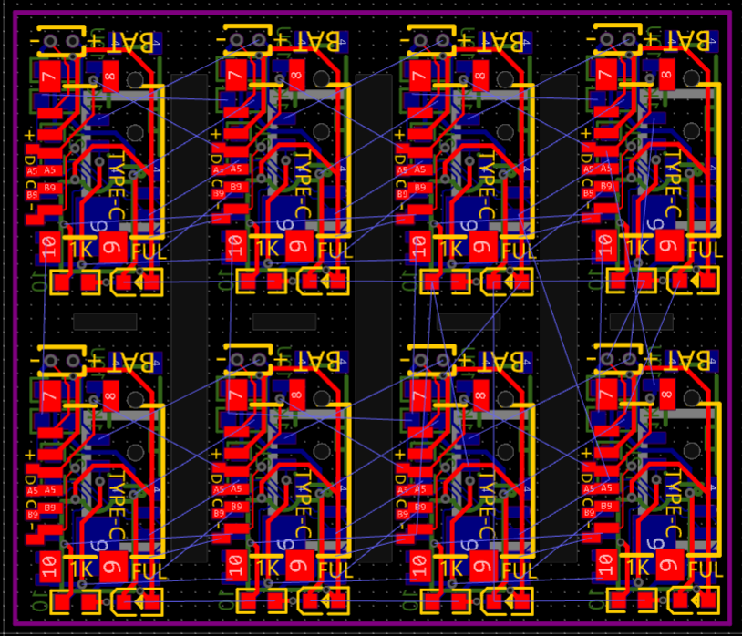
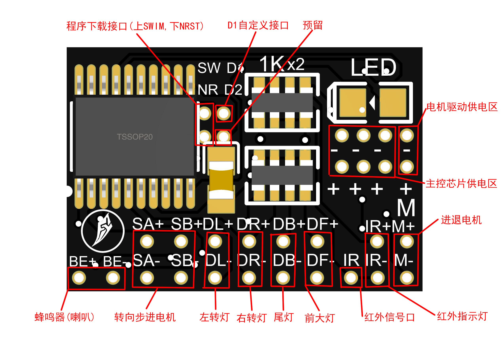
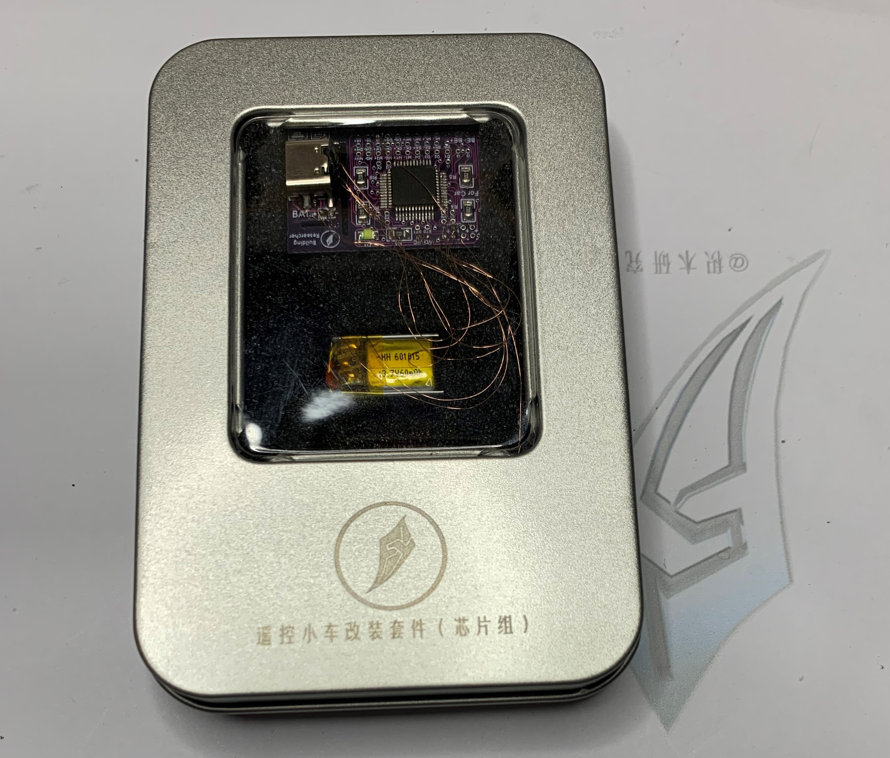

# 1:124坦克系列改装电路&PCB介绍
## 1:124坦克系列PCB同1:87系列[点击跳转](/pcb/1比87系列-STM8红外遥控方案/README.md)
- 电路部分主要包含：充电小板，主控小板。
- 涉及知识：PWM波控制，红外接收，中断，定时器，电机驱动，步进电机驱动，充电控制等，涉及芯片：主控芯片stm8s003f3p6或stm8s003f3u6,充电芯片TP4056,驱动芯片L9110s，Mos管等，都是些入门的器件和知识，初学者练手极佳。
- [【视频教程】套件焊接教程](https://www.bilibili.com/video/BV16s4y1m7GQ/?spm_id_from=333.999.0.0&vd_source=89cad0e1890ff49027d6a9f92e9147a6)
- [【文档教程】改装套件使用教程](https://www.wolai.com/ksv9qGV1nwmhjUrozgD7f1)

### 1:87系列充电小板
- 因为板子比较小，厂家一般不会单独印刷，已2X4拼板处理
- 为小车电池充电，3.7v锂电池通用，type-c充电接口。

 

### 1:87系列排插小板
- 因为板子比较小，厂家一般不会单独印刷，已3X5拼板处理
- 方便电路焊接，不含任何元器件，充当排插

 

### 1:87系列主控小板
- 基于STM8

 

## 使用方法
- 嘉立创绘制，打开嘉立创eda，导入即可，.epro或.zip格式都可导入

[//]: # (## 量产区up主福利)

[//]: # (- 懒得画电路敲代码可淘宝搜“积木研究圆的小车改装店”，有部分现成提供&#40;随缘上架哦！&#41;)

[//]: # (- 1:64芯片套件：[https://item.taobao.com/item.htm?ft=t&id=737362891443]&#40;https://item.taobao.com/item.htm?ft=t&id=737362891443&#41;)

[//]: # (- 1:87改装套件：[https://item.taobao.com/item.htm?ft=t&id=737272654141]&#40;https://item.taobao.com/item.htm?ft=t&id=737272654141&#41;)

[//]: # ()
[//]: # (- 量产芯片组套件长这样)

[//]: # ()
[//]: # ( )