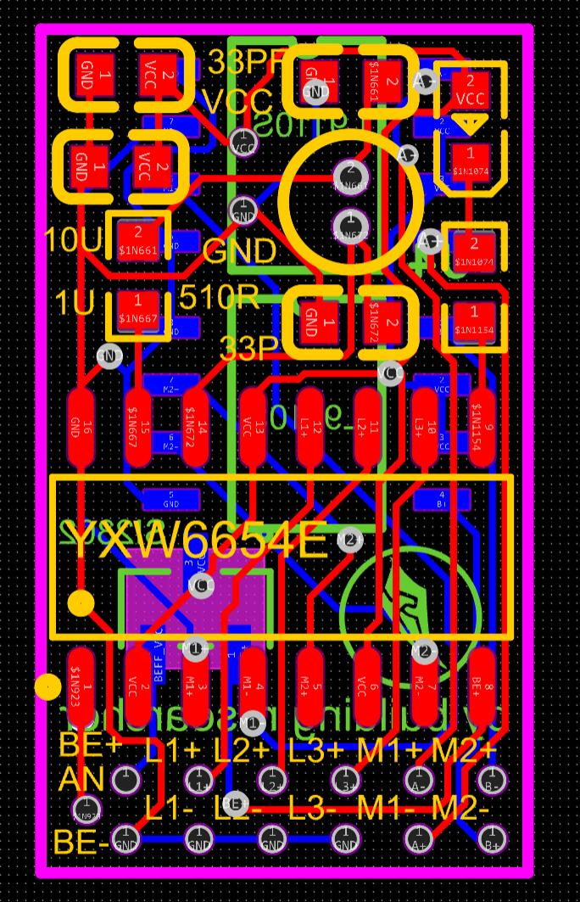
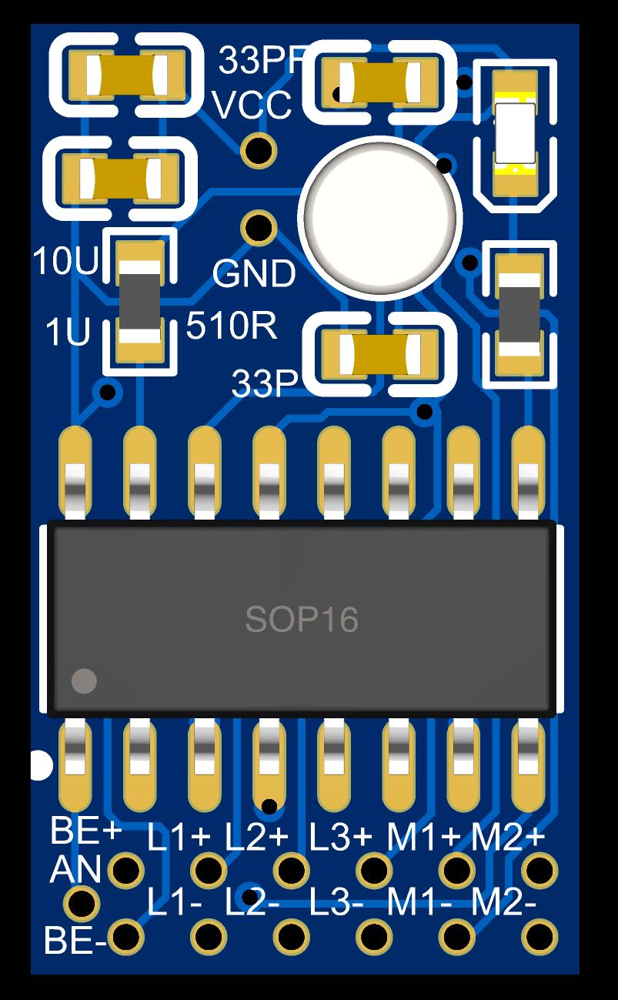
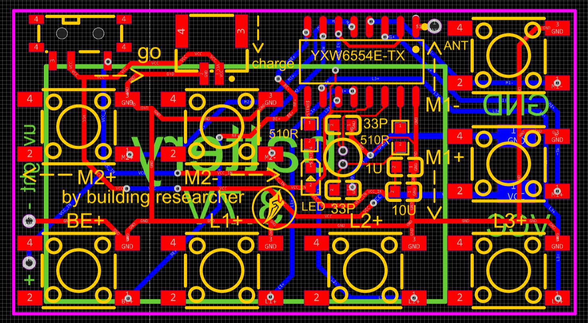
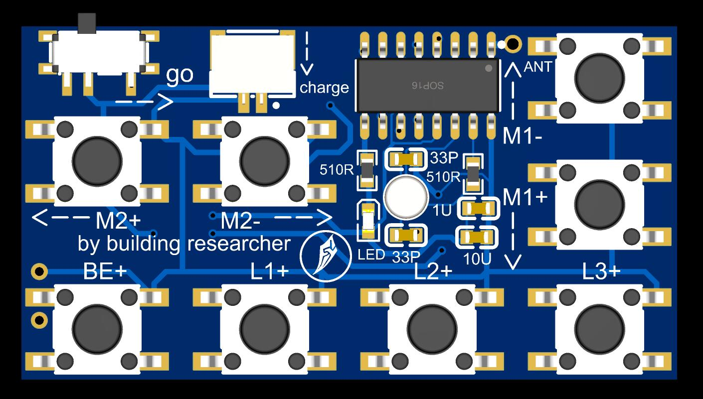

# 1:64系列2.4G遥控改装电路&PCB介绍
- 电路部分主要包含：接收小板（接收机），发射小板（遥控器）。
- [【视频教程】套件焊接教程](https://www.bilibili.com/video/BV16s4y1m7GQ/?spm_id_from=333.999.0.0&vd_source=89cad0e1890ff49027d6a9f92e9147a6)
- [【文档教程】改装套件使用教程](https://www.wolai.com/ksv9qGV1nwmhjUrozgD7f1)

### 1:64系列2.4G遥控接收小板
- 板子尺寸为1.08cm x 1.87cm，不局限与1:64，更大或更小的都可以放进去
- 通用3.7v锂电池供电，可以配合1比41系列中的开关小板。

 

### 1:64系列2.4G遥控发射小板
- 板子尺寸为4.61cm x 2.49cm
- 通用3.7v锂电池供电，已集成开关与充电接口，充电可使用其他系列里的充电小板
- 每个按键对应接收小板上一对接口的通断或正反

 

## 使用方法
- 嘉立创绘制，打开嘉立创eda，导入即可，.epro或.zip格式都可导入

[//]: # (## 量产区up主福利)

[//]: # (- 懒得画电路敲代码可淘宝搜“积木研究圆的小车改装店”，有部分现成提供&#40;随缘上架哦！&#41;)

[//]: # (- 1:64芯片套件：[https://item.taobao.com/item.htm?ft=t&id=737362891443]&#40;https://item.taobao.com/item.htm?ft=t&id=737362891443&#41;)

[//]: # (- 1:87改装套件：[https://item.taobao.com/item.htm?ft=t&id=737272654141]&#40;https://item.taobao.com/item.htm?ft=t&id=737272654141&#41;)

[//]: # ()
[//]: # (- 量产芯片组套件长这样)

[//]: # ()
[//]: # ( )