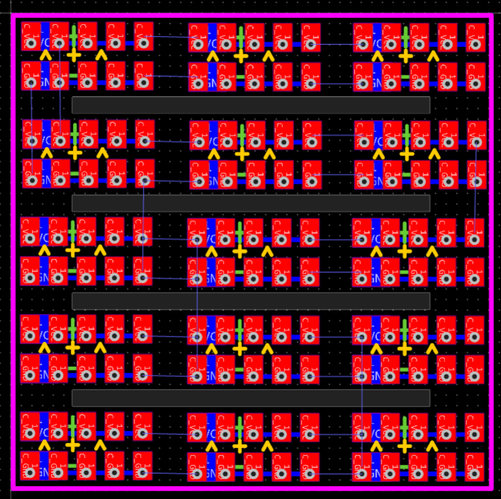
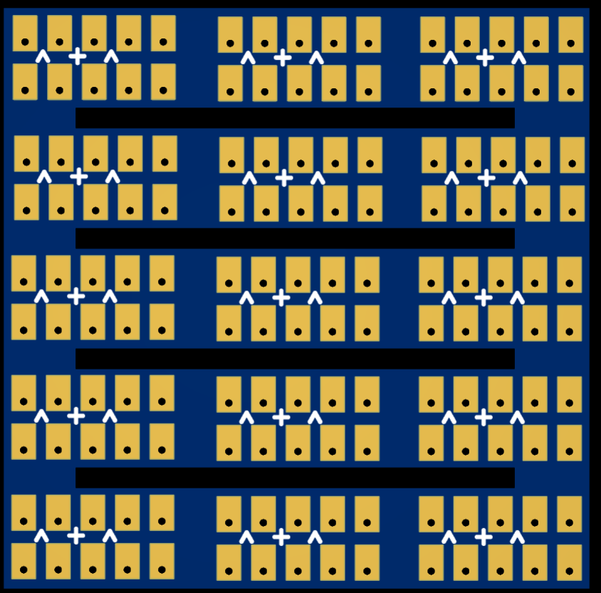

# 1:87系列小车改装电路&PCB介绍
- 电路部分主要包含：充电小板，排插小板。
- 1:87系列比较小，取消主板设计，直接使用芯片进行焊接。
- 涉及知识：PWM波控制，红外接收，中断，定时器，电机驱动，步进电机驱动，充电控制等，涉及芯片：主控芯片stm8s003f3p6或stm8s003f3u6,充电芯片TP4056,驱动芯片L9110s，Mos管等，都是些入门的器件和知识，初学者练手极佳。
- [【视频教程】套件焊接教程](https://www.bilibili.com/video/BV1zN4y1F7QH/?spm_id_from=333.999.0.0&vd_source=89cad0e1890ff49027d6a9f92e9147a6)
- [【文档教程】改装套件使用教程](https://www.wolai.com/ksv9qGV1nwmhjUrozgD7f1)

### 1:87系列充电小板
- 因为板子比较小，厂家一般不会单独印刷，已2X4拼板处理
- 为小车电池充电，3.7v锂电池通用，type-c充电接口。

 

### 1:87系列排插小板
- 因为板子比较小，厂家一般不会单独印刷，已3X5拼板处理
- 方便电路焊接，不含任何元器件，充当排插

 

## 量产区up主福利
- 嫌焊电路麻烦，该芯片组部分已半量产，有需要的同学可各平台 **@积木研究圆**私信或留言，咸鱼可能有，各模块已焊好，芯片已下好程序，并调试好

- 量产芯片组套件长这样

 