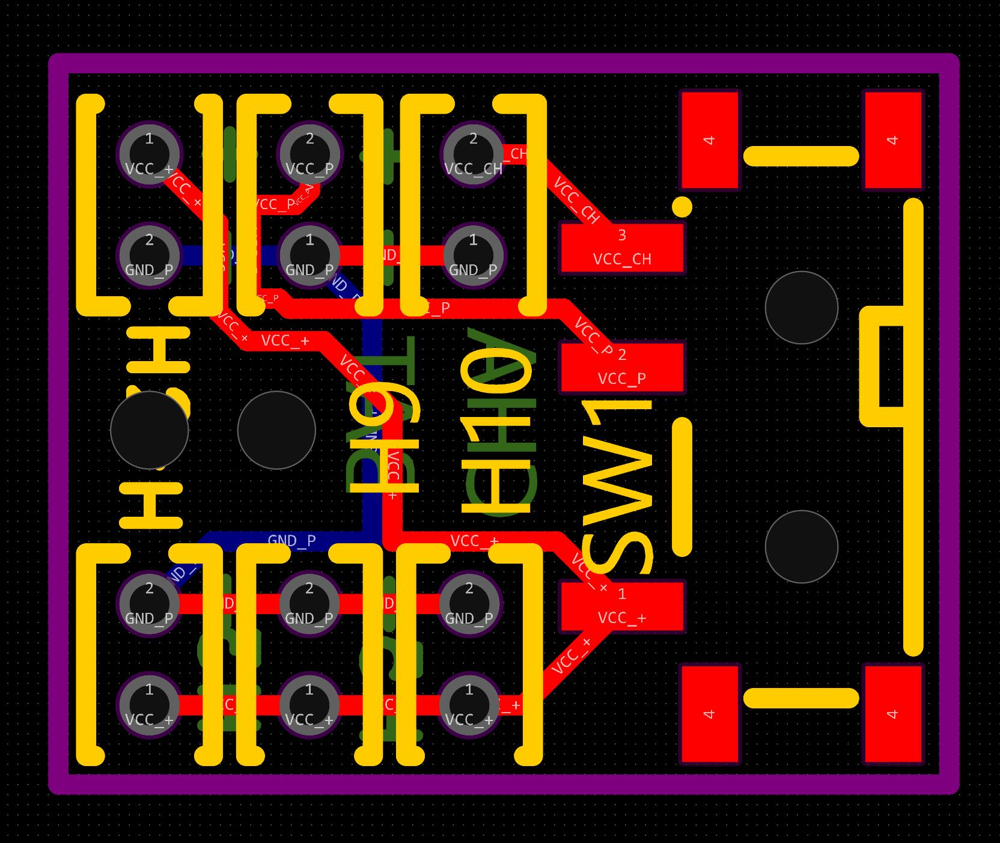
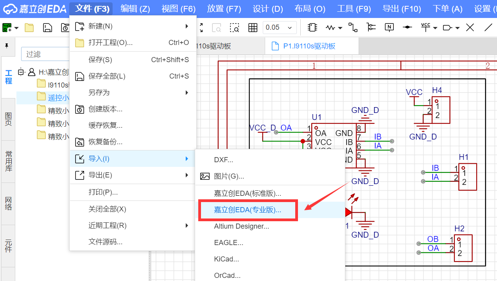

# 小车改装电路&PCB介绍
- 电路部分主要包含：主控小板，TP4056充电小板，开关小板，L9110s驱动小板，SI2302驱动小板。
- 涉及知识：PWM波控制，红外接收，中断，定时器，电机驱动，步进电机驱动，充电控制等，涉及芯片：主控芯片stm32f103c6t6,充电芯片TP4056,驱动芯片L9110s，Mos管等，都是些入门的器件和知识，初学者练手极佳。

###主控小板
- 基于stm32f103c6t6(性价比高)，48引脚，小小板子可控制通道巨多

 

### TP4056充电小板
- 为小车电池充电，3.7v锂电池通用，type-c充电接口。

 

### L9110s驱动小板
- 基于L9110s驱动芯片，控制一路电机正反转，外围电路少，简单实用。

 

### SI2302驱动小板
- 基于型号为SI2302的3脚mos管，控制一路通断。

 

### 开关小板
- 就是带开关的插线板，充电接口也在这。

 

## 使用方法
- 嘉立创绘制，打开嘉立创eda，导入即可

## 量产区up主福利
- 嫌焊电路麻烦，该芯片组部分已量产，可直接咸鱼@积木研究圆购买，各模块已焊好，芯片已下好程序，并调试好
- 咸鱼链接：

 